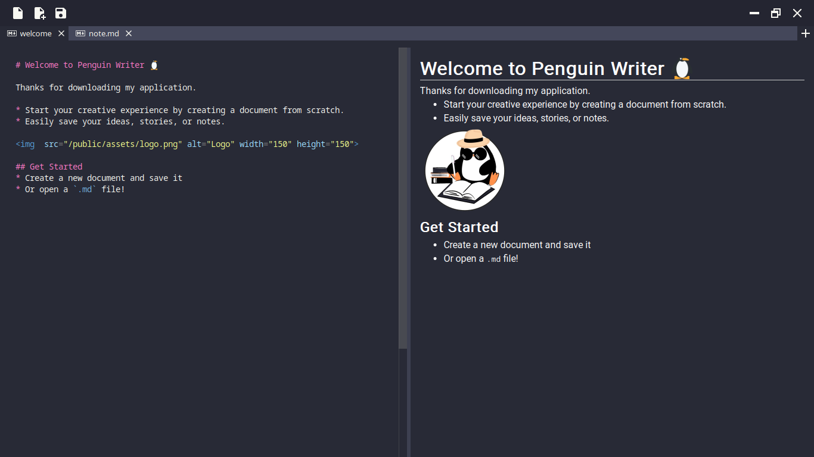

# Penguin Writer 🐧

Aplication for write notes in markdown. The aplication is made in Tauri to use web technologies for a desktop app, Typescript for type safety, Svelte as frontend and Rust as backend.



## Prerequisites

- Install [tauri](https://tauri.app/v1/guides/getting-started/prerequisites)
- Install the javascript dependencies `pnpm install`

## Scripts

This creates a dev build and rebuilt when you make changes.

```bash
pnpm dev
```

This creates a production-ready version of the app.

```bash
pnpm build
```
